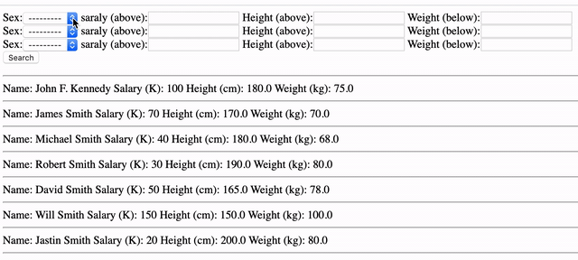

# Django_Formset_Factory

[referred blog](https://narito.ninja/blog/detail/94/)



> ## models.py
``` python

```

> ## admin.py
``` python

```

> ## views.py
``` python

```

> ## urls.py
``` python

```

> ## base.html
``` python

```

> ## post_list.html
``` python

```
